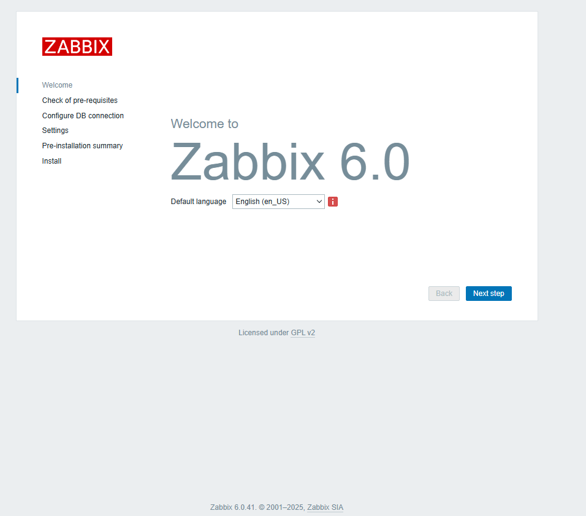
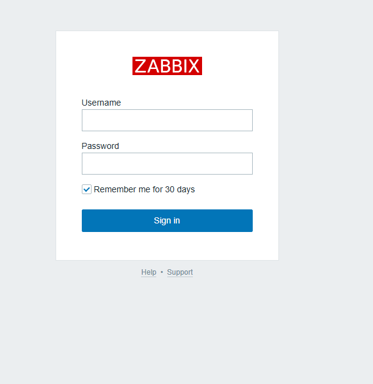
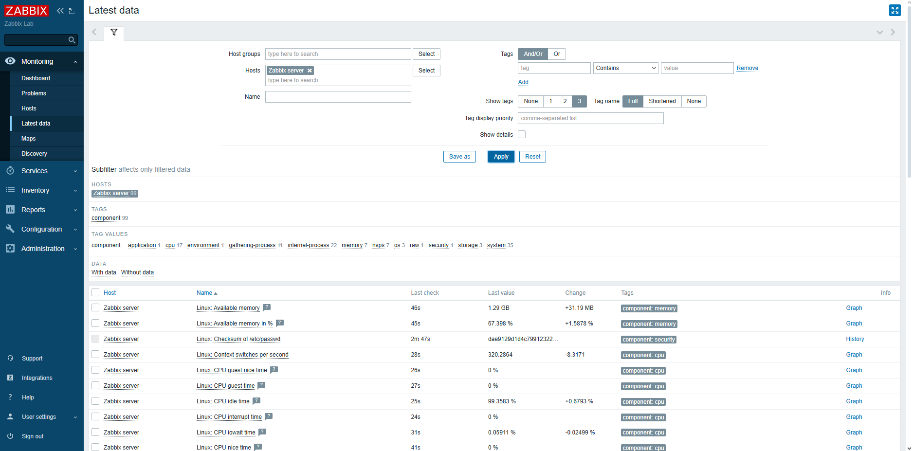
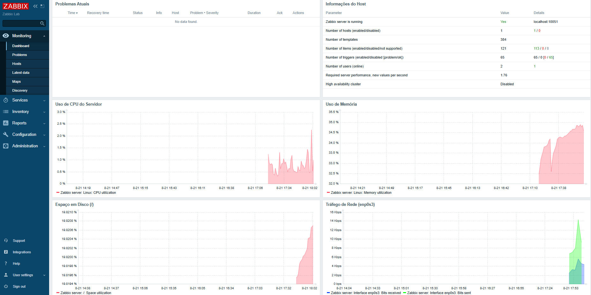

# Laboratório de Monitoramento com Zabbix

Este projeto tem como objetivo a criação de um **laboratório prático** para estudo e experimentação do **Zabbix** em um ambiente virtualizado utilizando **VirtualBox** e **Ubuntu Server 22.04 LTS**.

---

## 📌 Objetivos do Projeto
- Instalar e configurar o **Zabbix Server** em uma máquina virtual Linux.
- Configurar o **Zabbix Agent** para monitorar o próprio servidor e serviços locais.
- Criar **dashboards e gráficos** no Zabbix para acompanhar métricas de CPU, memória, disco e rede.

---

## 🛠️ Tecnologias Utilizadas
- VirtualBox (para virtualização)
- Ubuntu Server 22.04 LTS
- Zabbix 6 LTS (Server + Agent + Frontend Web)
- Apache / Nginx, PHP e PostgreSQL
- Git & GitHub (para versionamento e documentação)

---

## 🚀 Passo a Passo do Projeto

### 1️⃣ Preparação do Ambiente
1. Instalar o [VirtualBox](https://www.virtualbox.org/) (se ainda não estiver instalado).
2. Baixar a ISO do [Ubuntu Server 22.04 LTS](https://releases.ubuntu.com/22.04/?_ga=2.149898549.2084151835.1707729318-1126754318.1683186906&_gl=1*c0yfxt*_gcl_au*MzI4NDIwMjcxLjE3NTU3ODgyMTM.).
3. Criar uma nova VM no VirtualBox com as seguintes configurações:
   - Nome: `zabbix-lab`
   - CPU: 2 vCPUs
   - Memória: 2 GB (mínimo recomendado)
   - Disco: 20 GB
   - Rede: Adaptador Bridge (ou NAT com porta liberada para HTTP/SSH)

---

### 2️⃣ Instalação do Sistema Operacional
1. Inicie a VM e instale o Ubuntu Server.
2. Configure um usuário administrador (ex: `zabbixadmin`).
3. Ative o **SSH Server** durante a instalação (opcional, mas recomendado).
4. Atualize o sistema:
   ```bash
   sudo apt update && sudo apt upgrade -y
   ```

---

### 3️⃣ Instalação do Zabbix Server + Frontend
1. Baixar e instalar o repositório oficial do Zabbix:
   ```bash
   wget https://repo.zabbix.com/zabbix/6.0/ubuntu/pool/main/z/zabbix-release/zabbix-release_6.0-4+ubuntu22.04_all.deb
   sudo dpkg -i zabbix-release_6.0-4+ubuntu22.04_all.deb
   sudo apt update
   ```

2. Instalar os pacotes do Zabbix Server, frontend e agente:
   ```bash
   sudo apt install zabbix-server-pgsql zabbix-frontend-php zabbix-apache-conf zabbix-sql-scripts zabbix-agent -y
   ```

3. Instalar o PostgreSQL e configurar o banco:
   ```bash
   sudo apt install postgresql -y
   sudo -u postgres createuser --pwprompt zabbix
   sudo -u postgres createdb -O zabbix zabbix
   zcat /usr/share/zabbix-sql-scripts/postgresql/server.sql.gz | sudo -u zabbix psql zabbix
   ```

4. Editar o arquivo `/etc/zabbix/zabbix_server.conf` e configurar a senha do banco.

5. Iniciar e habilitar os serviços:
   ```bash
   sudo systemctl restart zabbix-server zabbix-agent apache2
   sudo systemctl enable zabbix-server zabbix-agent apache2
   ```

6. Acessar a interface web:
   - Abra no navegador: `http://<IP_DO_SERVIDOR>/zabbix`
   - Login padrão: **Admin / zabbix**

---

### 4️⃣ Configuração do Zabbix Agent
1. Editar o arquivo `/etc/zabbix/zabbix_agentd.conf`:
   ```
   Server=127.0.0.1
   ServerActive=127.0.0.1
   Hostname=Zabbix server
   ```

2. Reiniciar o agente:
   ```bash
   sudo systemctl restart zabbix-agent
   ```

---

### 5️⃣ Testes e Validação
- Criar hosts no Zabbix.
- Configurar itens de monitoramento (CPU, memória, disco, rede).
- Criar triggers e alertas básicos.
- Montar dashboards personalizados.

---

## 📂 Estrutura do Repositório
```
zabbix-lab/
│── README.md         # Documentação principal
│── .gitignore        # Arquivos ignorados pelo Git
│── docs/             # Prints de tela e diagramas
│── scripts/          # Scripts auxiliares
```

---

## 📸 Evidências

- Tela Inicial do Zabbix:




- Tela de Login do Zabbix:




- Métricas de dados:




- Dashboard Personalizado Atualizado:




---

### 📝 Observações e Aprendizados do Projeto

Durante a montagem deste laboratório, enfrentei alguns desafios que foram cruciais para o meu aprendizado e aprofundamento técnico:

* **Compatibilidade de Versão:** Inicialmente, tentei executar o projeto em uma VM com `Ubuntu 24.04 LTS` e encontrei erros de dependências (`unmet dependencies`). Isso reforçou a importância de sempre utilizar a versão do sistema operacional especificada na arquitetura do projeto. Reinstalei a VM com a versão correta, **`Ubuntu 22.04 LTS`**, para garantir total compatibilidade com os pacotes do Zabbix 6.0.

* **Ordem de Execução de Comandos:** Em uma nova VM, deparei-me com o erro `Unable to locate package`. Este problema ocorreu porque a etapa de instalação (`apt install`) foi executada antes da adição e atualização do repositório oficial do Zabbix. A sequência correta e fundamental para o sucesso da instalação é:
    1.  Adicionar a nova fonte de software (`dpkg -i zabbix-release...`).
    2.  Atualizar a lista de pacotes do sistema para incluir as novas fontes (`apt update`).
    3.  Instalar o pacote desejado (`apt install`).

Este processo de troubleshooting foi extremamente valioso para solidificar meu conhecimento em gerenciamento de pacotes e dependências em ambientes Linux.

---

## ✨ Conclusão
Este laboratório é uma forma prática de aprender sobre **monitoramento de infraestrutura com Zabbix**, demonstrando conhecimentos técnicos em **Infraestrutura e Cloud**.

